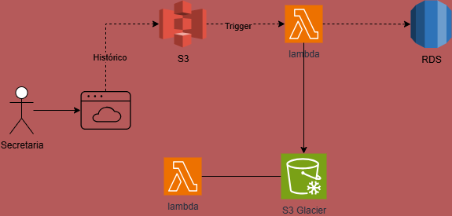

# 📚 Sistema de Armazenamento de Histórico Escolar com AWS

Este sistema armazena históricos escolares de forma **segura**, **escalável** e **otimizada em custos**, utilizando serviços da AWS.  
Ele permite que alunos solicitem históricos antigos mesmo após muitos anos, com recuperação automatizada.

---

## 🔄 Fluxo do Sistema

1. A secretaria envia o histórico escolar para o **Amazon S3**.  
2. Um **AWS Lambda** processa o arquivo e grava os dados no **Amazon RDS**.  
3. Após um período de tempo, históricos antigos são movidos para o **Amazon S3 Glacier**, reduzindo custos de armazenamento.  
4. Quando um aluno solicita um histórico antigo:  
   - O sistema inicia a **recuperação no Glacier** (processo que pode levar algumas horas).  
   - Quando o arquivo é restaurado para o S3, um **Lambda** é acionado automaticamente para processá-lo e disponibilizá-lo à secretaria.  

---

## 🛠️ Serviços Utilizados

- **Amazon S3** – Armazenamento assíncrono de arquivos.  
- **Amazon S3 Glacier** – Armazena históricos antigos de baixo custo, com recuperação sob demanda.  
- **AWS Lambda** – Automatiza o processamento de arquivos e gerencia a recuperação do Glacier.  
- **Amazon RDS** – Banco de dados relacional que armazena as informações dos alunos de forma segura e estruturada.  

---

## 📌 Observações Importantes

- A recuperação de arquivos no **S3 Glacier** não é imediata e pode levar de algumas horas até mais de um dia, dependendo do tipo de requisição.  
- O **Amazon RDS** garante consultas rápidas e estruturadas, sendo o repositório central da secretaria.  
- O uso de **Lambda + EventBridge** garante automação completa, sem necessidade de intervenção manual.  

---

